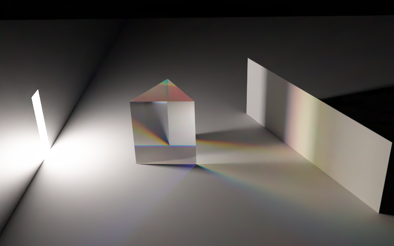

# Rende Toy



A toy spectral renderer.

# Features

+ Spectral stochastic MIS ([Continuous Multiple Importance Sampling, ACM Trans. Graph. (SIGGRAPH), 2020](https://profs.etsmtl.ca/agruson/publication/2020_CMIS/))
+ Spectral upsampling ([A Low-Dimensional Function Space for Efficient Spectral Upsampling, In Computer Graphics Forum (Proceedings of Eurographics 2019)](https://rgl.epfl.ch/publications/Jakob2019Spectral))
+ Material
    + Diffuse
    + Glass (With Dispersion)
    + Mirror
+ Blackbody emission

# Requirements

+ Optix 7.1.0
+ CUDA 10.0 or later

# Build

Just build with default setting.

Run
```
toy_exe <the_scene.toml>
```

There is a tool `obj2ma` for importing `.obj` file as `.ma` file that can be read by this renderer.
